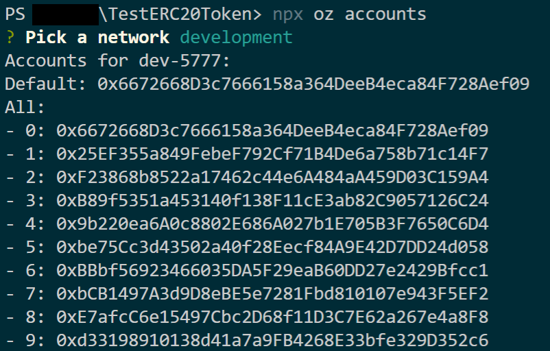
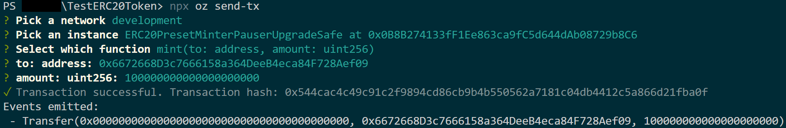

# ERC20-OZ-SDK
We will learn how to deploy an ERC20 smart contract using the [OpenZeppelin SDK](https://github.com/OpenZeppelin/openzeppelin-sdk). We will also write a `TokenExchange` contract, that will allow any user to purchase an ERC20 token in exchange for ETH, at a fixed exchange rate. We will write the `TokenExchange` smart contract ourselves, but leverage the [ERC20 implementation](https://docs.openzeppelin.com/contracts/3.x/erc20) from [OpenZeppelin contracts](https://docs.openzeppelin.com/contracts/3.x/).

## Install
First, install [Node.js](http://nodejs.org/) and [npm](https://npmjs.com/). Then, install the OpenZeppelin SDK (globally) running:

```
npm install -g @openzeppelin/cli
```

> If you get an `EACCESS permission denied` error while installing, please refer to the [npm documentation on global installs permission errors](https://docs.npmjs.com/resolving-eacces-permissions-errors-when-installing-packages-globally). Alternatively, you may run `sudo npm install --unsafe-perm --global @openzeppelin/cli`, but this is highly discouraged, and you should rather either use a node version manager or manually change npm's default directory.

## Setup
I recommend using the OpenZeppelin SDK through the `openzeppelin SDK` command line interface.

To start, create a directory for the project and access it:

```
mkdir TestERC20Token
cd TestERC20Token
```

Use `npm` to create a `package.json` file:

```
npm init -y
```

And initialise the OpenZeppelin SDK project:

```
npx oz init
```

Now it is possible to use `npx openzeppelin deploy` to create instances for these contracts that 
later can be upgraded, and many more things.

Run `npx openzeppelin --help` for more details about thes and all the other functions of the
OpenZeppelin CLI.

## ERC20 Smart Contract
We will first get ourselves an ERC20 token. Instead of coding one from scratch, we will use the one provided by the [OpenZeppelin Contracts Ethereum Package](https://github.com/OpenZeppelin/openzeppelin-contracts-ethereum-package). An Ethereum Package is a set of contracts set up to be easily included in an OpenZeppelin project, with the added bonus that the contracts' code *is already deployed in the Ethereum network*. This is a more secure code distribution mechanism, and also helps you save gas upon deployment.

To link the OpenZeppelin Contracts Ethereum Package into your project, simply run the following:
```
npx oz link @openzeppelin/contracts-ethereum-package
```

This command will download the Ethereum Package (bundled as a regular npm package), and connect it to your OpenZeppelin project. We now have all of OpenZeppelin contracts at our disposal, so let’s create an ERC20 token!
> Make sure you install `@openzeppelin/contracts-ethereum-package` and not the vanilla `@openzeppelin/contracts`. The latter is set up for general usage, while `@openzeppelin/contracts-ethereum-package` is tailored for being used with [OpenZeppelin Upgrades](https://docs.openzeppelin.com/upgrades/2.8/). This means that its contracts are [already set up to be upgradeable](https://docs.openzeppelin.com/upgrades/2.8/writing-upgradeable#use-upgradeable-packages).

Let’s deploy an ERC20 token contract to our `development` network. Make sure to have a [Ganache](https://www.trufflesuite.com/ganache) instance running, or start one by running:

```
 npx ganache-cli --deterministic
 ```
 For setting up the token, we will be using the [ERC20PresetMinterPauser](https://github.com/OpenZeppelin/openzeppelin-contracts-ethereum-package/blob/master/contracts/presets/ERC20PresetMinterPauser.sol) implementation provided by the OpenZeppelin package. We will *initialize* the instance with the token metadata (name, symbol), and then mint a large initial supply for one of our accounts.

Check the RPC server for your Ganache environment and adjust the correct port in the `network.js` file.
> Usually you have to adjust the port from 8545 to 7545.


Let’s break down what we did in the command above. We first chose to create an instance of the `ERC20PresetMinterPauserUpgradeSafe` contract from the `@openzeppelin/contracts-ethereum-package` package we had linked before, and to create it in the local `development` network. We are then instructing the CLI to *initialize* it with the initial values needed to set up our token. This requires us to choose the appropriate `initialize` function, and input all the required arguments. The OpenZeppelin CLI will then atomically deploy and initialize the new instance in a single transaction.

We now have a working ERC20 token contract in our `development` network.

Next we get the accounts we have setup


Then we mint 100 TERC20 to our default account

> The standard ERC20 smart contract has 18 decimals, i.e. 1 token = $10^18$.
